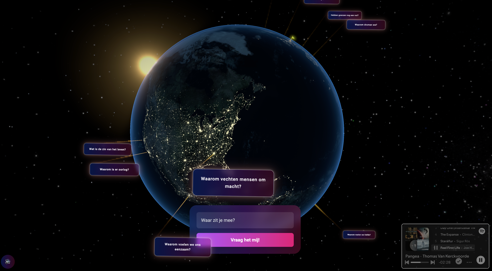

# NeoPangea

> A philosophical and introspective app that helps users explore deep questions about life, identity, society, and existence. Connect with thought-provoking ideas tied to locations around the world. Each question is inspired by cultural, historical, or societal themes specific to the location it represents.
> 
> This project started as an experiment in exploring philosophical questions, technology, and creative expression. It grew during a period where I found myself deeply reflecting on many of the same questions posed in the app. This intersection of personal curiosity and technical growth gave life to NeoPangea.

## Table of Contents
- [NeoPangea](#neopangea)
  - [Table of Contents](#table-of-contents)
  - [Features](#features)
  - [Installation](#installation)
  - [Usage](#usage)
    - [Configuration](#configuration)
    - [Development](#development)
    - [Production / Vercel Deployment](#production--vercel-deployment)
  - [Contributing](#contributing)
  - [License](#license)
  - [Credits](#credits)
## Features

- Explore deep philosophical questions tied to specific locations worldwide.
- Questions are inspired by cultural, historical, and societal themes unique to each region.
- Interactive and engaging interface for reflecting on life's biggest questions.
- Server-client architecture for seamless performance and scalability.
- Built-in linting and type checking for maintaining clean and consistent code.

## Installation

1. Clone the repository:
   
   `git clone git@github.com:thaoms/neo-pangea.git`
2. Navigate to the project directory:
   
   `cd neo-pangea`
3. Use `nvm` to set the correct Node.js version:
   
   `nvm use`
4. Install dependencies:
   
   `pnpm i`
5.  If you haven’t installed the Vercel CLI globally, run: `pnpm i -g vercel`

## Usage

### Configuration

- You need to fetch the `.env.local` with variables from Vercel:
  - `vercel env pull`

### Development

1. Lint the project:
   
   `pnpm lint`
2. Start the server:
   
   `pnpm type-check`
3. Start the app:
   
   `vercel dev`

### Production / Vercel Deployment
1. `pnpm build`
      
2. `pnpm preview`

3. Deploy to Vercel
   1. If you haven’t installed the Vercel CLI globally, run: `pnpm i -g vercel`
   2. Then, from the project root directory: `vercel`
   
   Follow the prompts (or use `vercel --prod` for production).

## Contributing

We welcome contributions! Please follow these steps:

1. Fork the repository.
2. Create a new branch:
   
   `git checkout -b feature/your-feature-name`
3. Commit your changes:
   
   `git commit -m "Add your message here"`
4. Push to your branch:
   
   `git push origin feature/your-feature-name`
5. Open a pull request.

## License

This project is licensed under the MIT License. See the [LICENSE](./LICENSE) file for details.

## Credits

This project uses several open-source libraries, frameworks, and assets. 
Please refer to the [CREDITS.md](CREDITS.md) file for detailed acknowledgments.
